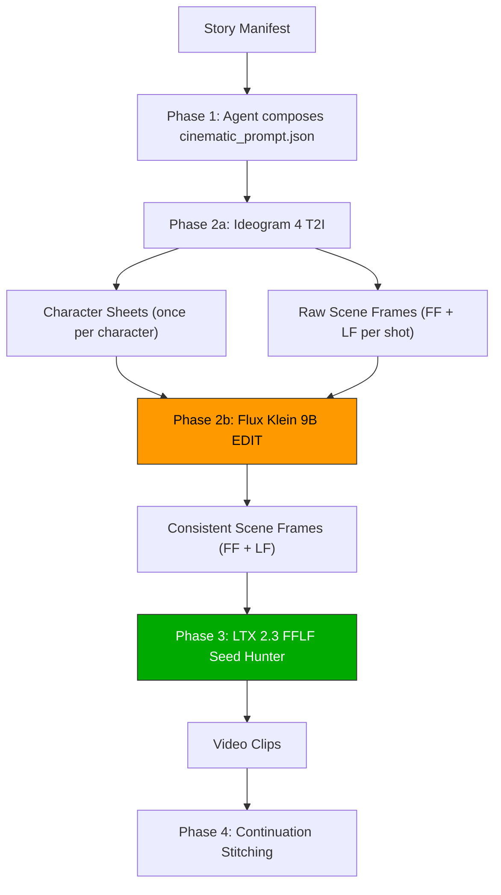

# v2.0.0 — Cinematic Pipeline Release (2026-06-13)

A new skill that replaces the `story-to-video-filmmaking` pipeline's image generation stack with a 3-stage model chain (Ideogram 4 T2I → Flux Klein 9B **Edit** → LTX 2.3 FFLF), producing higher-quality character-consistent cinematic video from story manifests.

## Core Pipeline Architecture



### Stage 1: Ideogram 4 (T2I)
- **Role:** Generator — character sheets + raw scene frames
- **Why:** Structured JSON prompt system (bbox spatial control, HLD, style decon), built-in LLM rewriter, best-in-class designed compositions.

### Stage 2: Flux Klein 9B (I2I)
- **Role:** Editor — character consistency refinement
- **Why:** Pure edit model — takes a scene + character ref and *edits* the scene to match character identity. NOT a generator. The prompt describes the **delta** (what to change), not the entire scene.

### Stage 3: LTX 2.3 FFLF Seed Hunter
- **Role:** Video engine (unchanged)
- **Why:** Takes FF+LF keyframes → video. Production-proven, untouched.

---

## Trigger

- User has a `story_manifest.json` and wants to produce a coherent animated film.
- User wants to use the cinematic pipeline (Ideogram 4 T2I + Flux Klein Edit + LTX 2.3 FFLF) for superior character consistency and prompt alignment.

## Quick Start (Working CLI Invocation)

Always pass `--url` and `--auth` explicitly to the current ComfyUI instance.

```bash
cd <story_dir>
python3 current-setup/skills/story-to-video-cinematic/scripts/cinematic_orchestrator.py \
    --prompts cinematic_prompt.json \
    --url "https://<your-comfyui>.trycloudflare.com" \
    --auth "vastai:$(grep ^COMFYUI_AUTH /root/.hermes/.env | cut -d= -f2)" \
    --skip-existing 2>&1 | tee _orchestrator_run.log
```

## Cinematic Prompt Schema (`cinematic_prompt.json`)

The schema evolves from `filmmaking_prompt.json` by adding:
- `characters` dictionary mapping character identifier names to their description, style notes, and `edit_prompt_descriptor` (which is used to compose Flux Klein edit prompts).
- `edit_pass` field per shot mapping `ff_edit_prompt` and `lf_edit_prompt` instructions.
- `primary_character` field per shot indicating the key character reference sheet to inject.

See `references/cinematic-prompt-schema.md` for details.
