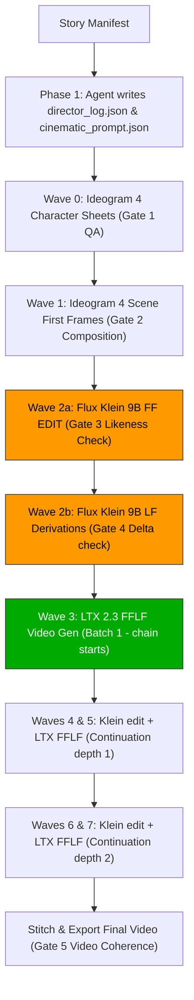

# v3.1.0 — Batch-Wave Cinematic Pipeline Release (2026-06-16)

This skill implements the **Batch-Wave Execution Model** which groups ComfyUI prompts to minimize model swaps (max 8 swaps regardless of story length) and introduces **Dynamic Multi-Character Flux Klein Editing**, the **V3.1 cinematic prompt schema**, **automated quality evaluation gates** (Image & Video), and **Director Log** capture.

## Core Pipeline Architecture



---

## Batch-Wave Execution Model (8 GPU Swaps)

Instead of swapping models per shot (which causes `N * 3` swaps), the pipeline runs in waves:
* **Wave 0**: Generates all character sheets.
* **Wave 1**: Generates all chain_start/`##cut` First Frames (FFs) via Ideogram T2I.
* **Wave 2a**: Performs character consistency edits on FFs (Flux Klein).
* **Wave 2b**: Derives all Last Frames (LFs) from edited FFs (Flux Klein). *This split fixes the FF/LF race condition.*
* **Wave 3**: Generates first batch of LTX FFLF videos (chain starts) + extracts tail frames.
* **Wave 4 & 5 (Continuation Depth 1)**: Derives LFs from tail frames (Klein) and renders continuation videos (LTX).
* **Wave 6 & 7 (Continuation Depth 2)**: Derives LFs and renders further continuation videos.

---

## Director Log (Required)

Before running the orchestrator, the agent MUST write a `director_log.json` file alongside `cinematic_prompt.json` to capture its design reasoning, decisions regarding continuity chains, and prompt descriptors. See [09-director-log-example.md](file:///Users/muneesraja/projects/brainstorm/aurora/current-setup/skills/story-to-video-cinematic/examples/09-director-log-example.md) for details.

---

## Trigger

* User has a `story_manifest.json` and wants to produce a coherent animated film.
* User wants to use the V3.1 cinematic pipeline for superior character consistency and prompt alignment with quality control checks.

## Quick Start (Working CLI Invocation)

Always pass `--url` and `--auth` explicitly to the current ComfyUI instance.

```bash
cd <story_dir>
python3 current-setup/skills/story-to-video-cinematic/scripts/cinematic_orchestrator.py \
    --prompts cinematic_prompt.json \
    --url "https://<your-comfyui>.trycloudflare.com" \
    --auth "vastai:$(grep ^COMFYUI_AUTH /root/.hermes/.env | cut -d= -f2)" \
    --skip-existing 2>&1 | tee _orchestrator_run.log
```

---

## Worked Examples

We provide a comprehensive set of worked examples for every stage of the pipeline:

* **[01-director-decisions.md](file:///Users/muneesraja/projects/brainstorm/aurora/current-setup/skills/story-to-video-cinematic/examples/01-director-decisions.md)**: How the agent decides about `##cut` vs `##continue` and visual continuity.
* **[02-character-sheet-prompts.md](file:///Users/muneesraja/projects/brainstorm/aurora/current-setup/skills/story-to-video-cinematic/examples/02-character-sheet-prompts.md)**: Ideogram T2I character sheet prompt best practices.
* **[03-scene-ff-prompts.md](file:///Users/muneesraja/projects/brainstorm/aurora/current-setup/skills/story-to-video-cinematic/examples/03-scene-ff-prompts.md)**: Ideogram T2I scene still prompt formula.
* **[04-klein-edit-patterns.md](file:///Users/muneesraja/projects/brainstorm/aurora/current-setup/skills/story-to-video-cinematic/examples/04-klein-edit-patterns.md)**: Flux Klein edit patterns for single, multi-character, and LF derivation edits.
* **[05-motion-prompts.md](file:///Users/muneesraja/projects/brainstorm/aurora/current-setup/skills/story-to-video-cinematic/examples/05-motion-prompts.md)**: FFLF motion prompts and anti-jump-cut guidelines.
* **[06-full-story-dryrun-prompt.json](file:///Users/muneesraja/projects/brainstorm/aurora/current-setup/skills/story-to-video-cinematic/examples/06-full-story-dryrun-prompt.json)**: Fully valid V3 schema cinematic prompt file.
* **[06-full-story-dryrun.md](file:///Users/muneesraja/projects/brainstorm/aurora/current-setup/skills/story-to-video-cinematic/examples/06-full-story-dryrun.md)**: Detailed wave-by-wave execution walkthrough.
* **[07-continuity-chain-walkthrough.md](file:///Users/muneesraja/projects/brainstorm/aurora/current-setup/skills/story-to-video-cinematic/examples/07-continuity-chain-walkthrough.md)**: Step-by-step tail frame extraction logic.
* **[08-multi-character-scene.md](file:///Users/muneesraja/projects/brainstorm/aurora/current-setup/skills/story-to-video-cinematic/examples/08-multi-character-scene.md)**: Handling multi-character scenes and reference slot mapping.
* **[09-director-log-example.md](file:///Users/muneesraja/projects/brainstorm/aurora/current-setup/skills/story-to-video-cinematic/examples/09-director-log-example.md)**: Capturing agent planning reasoning in `director_log.json`.
* **[10-evaluation-gates-walkthrough.md](file:///Users/muneesraja/projects/brainstorm/aurora/current-setup/skills/story-to-video-cinematic/examples/10-evaluation-gates-walkthrough.md)**: Payload and response flows for Gates 1–5.

---

## Reference Documentation

* **[Cinematic Prompt Schema v3.1](file:///Users/muneesraja/projects/brainstorm/aurora/current-setup/skills/story-to-video-cinematic/references/cinematic-prompt-schema.md)**: Schema documentation.
* **[Flux Klein Edit Cookbook](file:///Users/muneesraja/projects/brainstorm/aurora/current-setup/skills/story-to-video-cinematic/references/flux-klein-edit-prompt-cookbook.md)**: Multi-character prompts patterns.
* **[Pipeline Architecture v2](file:///Users/muneesraja/projects/brainstorm/aurora/current-setup/skills/story-to-video-cinematic/references/pipeline-architecture.md)**: Core wave architecture.
* **[Batch-Wave Execution Reference](file:///Users/muneesraja/projects/brainstorm/aurora/current-setup/skills/story-to-video-cinematic/references/batch-wave-execution.md)**: Detailed model timeline.
