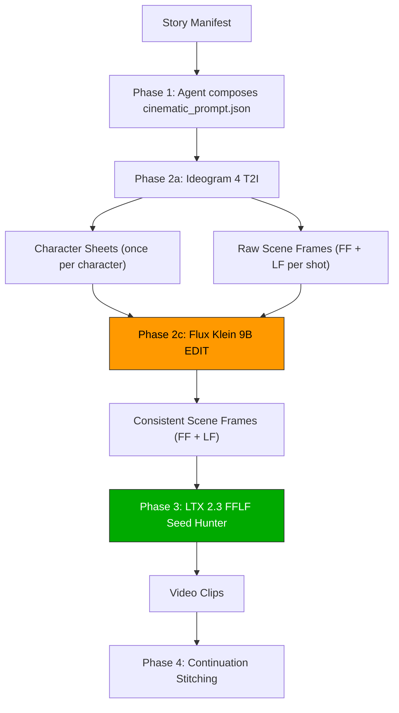

# Cinematic Pipeline Architecture

The `story-to-video-cinematic` pipeline orchestrates a three-stage model chain to produce character-consistent, high-fidelity videos.

## Visual Pipeline Diagram



## Folder Structure and Assets Flow

All assets generated during the run are stored in specific folders within the story directory:

```
📂 [story_dir]/
├── 📄 cinematic_prompt.json              # Schema v2.0 manifest
├── 📂 character_sheets/                  # Stage 1: Character sheets
│   └── 🖼️ [character]_character_sheet.png
├── 📂 scenes/                            # Stage 1: Raw scene frames (FF/LF)
│   ├── 🖼️ [prefix]_ff_raw.png
│   └── 🖼️ [prefix]_lf_raw.png
├── 📂 scenes_edited/                     # Stage 2: Character-consistent frames
│   ├── 🖼️ [prefix]_ff_edited.png
│   ├── 🖼️ [prefix]_lf_edited.png
│   └── 🖼️ [prefix]_tail_frame.png       # Extracted tail from previous video
└── 📂 videos/                            # Stage 3: Output video clips
    └── 🎬 [prefix].mp4
```

## Batch Processing Phase Design (Model Swap Optimization)

To fit all models (~93GB total) on a single 24GB VRAM GPU, execution is split into four distinct batch phases:

1. **Phase 1: Character Sheets Generation**
   - Loads Ideogram 4.0 T2I.
   - Generates character sheets for all characters in the story manifest on clean white backgrounds.
   - Unloads Ideogram.

2. **Phase 2: Raw Scene Keyframe Generation**
   - Loads Ideogram 4.0 T2I.
   - Generates all raw FF (First Frame) and LF (Last Frame) scene stills for all shots.
   - Unloads Ideogram.

3. **Phase 3: Flux Klein Edit Pass**
   - Loads Flux Klein 9B Image Edit.
   - Performs editing on all raw stills using the character sheets and composed edit instructions.
   - Saves final frames into `scenes_edited/`.
   - Unloads Flux Klein.

4. **Phase 4: FFLF Video Pipeline**
   - Loads LTX 2.3 FFLF.
   - Sequentially renders each shot's video using the consistent keyframes.
   - Extracts continuation tail frames for downstream shots in chains.
   - Unloads LTX.
