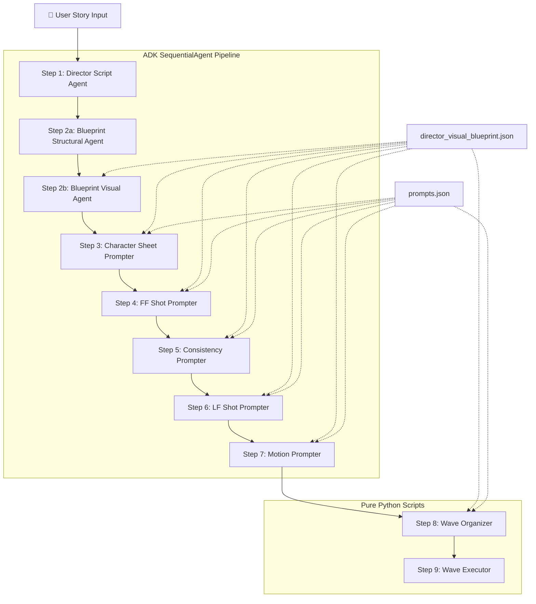

# Story-to-Video Deterministic Pipeline — Google ADK Implementation Plan

## Background

Revamping the existing `story-to-video-cinematic` skill from an agent-driven non-deterministic flow to a **fully scripted, deterministic pipeline** using Google ADK (Agent Development Kit). The pipeline takes a story and produces a set of videos using the FFLF (First Frame Last Frame) workflow with LTX Video 2.3.

### Key Reference Materials (for implementation phase)

> [!IMPORTANT]
> During implementation, the agent **must** refer to these original source documents for system prompt construction:
> - [AI-Film-making.md](file:///Users/muneesraja/projects/brainstorm/aurora/discussion-and-docs/deterministic-implementation-resource/AI-Film-making.md) — FFLF workflow rules, LTX model constraints, prompting guide
> - [ideogram-4-prompting-guide.md](file:///Users/muneesraja/projects/brainstorm/aurora/discussion-and-docs/deterministic-implementation-resource/ideogram-4-prompting-guide.md) — JSON prompt schema, bbox system, character placement
> - [ideogram-character-sheet.json](file:///Users/muneesraja/projects/brainstorm/aurora/discussion-and-docs/deterministic-implementation-resource/ideogram-character-sheet.json) — Character sheet structure reference
> - [FLUX-prompting-guide/](file:///Users/muneesraja/projects/brainstorm/aurora/discussion-and-docs/deterministic-implementation-resource/FLUX-prompting-guide) — Single-reference, multi-reference, and image editing guides
> - [V13_story_to_video_deterministic.md](file:///Users/muneesraja/projects/brainstorm/aurora/discussion-and-docs/implementation/V13_story_to_video_deterministic.md) — Schema design, delta taxonomy, few-shot examples

---

## Proposed Changes

### Architecture Overview



### ADK Architecture Choice

Using **SequentialAgent** (ADK 1.x pattern) for simplicity. Each step is an `LlmAgent` with:
- Custom system prompt (via `InstructionProvider` for JSON-heavy prompts — avoids `{key}` templating conflicts with literal JSON in instructions)
- `output_key` for state passing between agents
- `FunctionTool`s for file I/O operations
- Pydantic validation **post-response** (not `output_schema`, since LiteLLM/OpenRouter doesn't reliably support it)

### Model Selection via OpenRouter + LiteLLM

All agents use `LiteLlm` with OpenRouter:

```python
from google.adk.models.lite_llm import LiteLlm
import os

# Reasoning model — Steps 1, 2a, 2b, 6
REASONING_MODEL = LiteLlm(
    model="openrouter/google/gemini-3.1-pro-preview",
    api_key=os.getenv("OPENROUTER_API_KEY"),
    api_base="https://openrouter.ai/api/v1"
)

# Light model — Steps 3, 4, 5, 7
LIGHT_MODEL = LiteLlm(
    model="openrouter/google/gemini-2.5-flash",
    api_key=os.getenv("OPENROUTER_API_KEY"),
    api_base="https://openrouter.ai/api/v1"
)
```

### Image/Video Generation via ComfyUI Workflows

All image and video generation runs through ComfyUI with dynamic URL and auth from `.env`:

```
COMFYUI_URL=https://<instance>.trycloudflare.com
COMFYUI_AUTH=<token>
```

---

## Schema Design

> [!NOTE]
> Full schema definitions are in [V13_story_to_video_deterministic.md](file:///Users/muneesraja/projects/brainstorm/aurora/discussion-and-docs/implementation/V13_story_to_video_deterministic.md). Below is the definitive reference integrated into this plan.

### `director_visual_blueprint.json` — Master Schema

The single source of truth. All downstream agents read from and write back to this file.

```json
{
  "meta": {
    "story_title": "The Panda and the Butterfly",
    "style": "children's book watercolor illustration",
    "aesthetic": "warm, gentle, narrative",
    "total_duration_seconds": 42,
    "total_scenes": 3,
    "total_shots": 8,
    "created_at": "2026-06-17T10:00:00Z",
    "last_updated_at": "2026-06-17T12:00:00Z",
    "version": 1
  },

  "characters": [
    {
      "id": "char_01",
      "name": "Pippin the Panda",
      "appearance": "Chubby baby panda with round ears, black and white fur, bright curious eyes, small red scarf",
      "character_sheet_prompt": null,
      "character_sheet_path": null,
      "character_sheet_status": "pending"
    }
  ],

  "scenes": [
    {
      "scene_id": "scene_01",
      "scene_title": "The Forest Path",
      "scene_duration_seconds": 14,
      "environment": "Dense bamboo forest with dappled golden sunlight...",
      "time_of_day": "late morning",
      "lighting": "warm dappled sunlight, soft shadows",

      "shots": [
        {
          "shot_id": "scene_01_shot_01",
          "shot_index": 0,
          "duration_seconds": 4,
          "continuation_from_previous": false,
          "wave": 1,
          "characters_present": ["char_01"],
          "director_notes": "Opening establishing shot...",

          "ff": {
            "description": "Medium-wide shot of Pippin...",
            "camera_framing": "medium-wide, eye-level",
            "character_expressions": { "char_01": "curious, mouth slightly open" },
            "ideogram_prompt": null,
            "ideogram_prompt_status": "pending",
            "consistency_prompt": null,
            "consistency_prompt_status": "pending",
            "consistency_references": ["char_01"],
            "generated_image_path": null,
            "consistent_image_path": null,
            "generation_status": "pending"
          },

          "lf": {
            "description": "Same path, Panda has walked closer...",
            "camera_framing": "medium, eye-level",
            "character_expressions": { "char_01": "surprised, eyes wide" },
            "delta_from_ff": {
              "camera_change": "static camera, subject moves toward camera",
              "subject_changes": "Panda is now closer and larger in frame...",
              "environment_changes": "Slight wind moves bamboo leaves...",
              "particle_effects": "Dust motes in sunlight beams"
            },
            "flux_edit_prompt": null,
            "flux_edit_prompt_status": "pending",
            "flux_references": ["ff_image", "char_01"],
            "generated_image_path": null,
            "generation_status": "pending"
          },

          "motion": {
            "prompt": null,
            "prompt_status": "pending",
            "video_path": null,
            "extracted_last_frame_path": null,
            "generation_status": "pending"
          }
        },
        {
          "shot_id": "scene_01_shot_02",
          "shot_index": 1,
          "duration_seconds": 3,
          "continuation_from_previous": true,
          "wave": 2,
          "characters_present": ["char_01"],
          "director_notes": "Continuation from shot 1...",

          "ff": {
            "description": "INHERITED from scene_01_shot_01 last frame extraction",
            "source": "extracted_from_previous_video",
            "ideogram_prompt_status": "skipped",
            "consistency_prompt_status": "skipped",
            "consistency_references": [],
            "generation_status": "pending_wave_1"
          },

          "lf": {
            "description": "Panda gently cups the butterfly...",
            "delta_from_ff": {
              "camera_change": "subtle zoom in toward panda's face and paws",
              "subject_changes": "Arms raised to cup butterfly...",
              "environment_changes": "Background slightly more out-of-focus...",
              "particle_effects": "Butterfly wing shimmer, golden dust motes"
            },
            "flux_edit_prompt": null,
            "flux_edit_prompt_status": "pending",
            "flux_references": ["ff_image", "char_01"],
            "generated_image_path": null,
            "generation_status": "pending"
          },

          "motion": {
            "prompt": null,
            "prompt_status": "pending",
            "video_path": null,
            "extracted_last_frame_path": null,
            "generation_status": "pending"
          }
        }
      ]
    }
  ]
}
```

### `prompts.json` — Namespaced Prompt Store

Each agent step writes to its own namespace. Zero collision. Clear ownership.

```json
{
  "meta": {
    "blueprint_version": 1,
    "last_updated_by": "step_7_motion_prompter",
    "last_updated_at": "2026-06-17T12:00:00Z"
  },

  "character_sheets": {
    "char_01": {
      "prompt_type": "ideogram_json",
      "prompt": { "...ideogram JSON..." },
      "output_path": null,
      "status": "pending",
      "generated_by": "step_3_character_prompter"
    }
  },

  "ff_shots": {
    "scene_01_shot_01": {
      "prompt_type": "ideogram_json",
      "prompt": { "...ideogram JSON..." },
      "reference_images": [],
      "output_path": null,
      "status": "pending",
      "generated_by": "step_4_ff_prompter"
    },
    "scene_01_shot_02": {
      "prompt_type": "extracted_frame",
      "prompt": null,
      "reference_images": [],
      "output_path": null,
      "status": "pending_wave_1",
      "generated_by": "system"
    }
  },

  "consistency_patches": {
    "scene_01_shot_01": {
      "prompt_type": "flux_edit",
      "prompt": "Apply the character appearance from image 1...",
      "reference_images": [
        "{{character_sheets.char_01.output_path}}",
        "{{ff_shots.scene_01_shot_01.output_path}}"
      ],
      "output_path": null,
      "status": "pending",
      "generated_by": "step_5_consistency_prompter"
    }
  },

  "lf_shots": {
    "scene_01_shot_01": {
      "prompt_type": "flux_edit",
      "prompt": "The panda has walked closer to the camera...",
      "reference_images": [
        "{{consistency_patches.scene_01_shot_01.output_path}}",
        "{{character_sheets.char_01.output_path}}"
      ],
      "output_path": null,
      "status": "pending",
      "generated_by": "step_6_lf_prompter"
    }
  },

  "motion_prompts": {
    "scene_01_shot_01": {
      "prompt": "A panda walking forward along a forest path...",
      "duration_seconds": 4,
      "ff_image": "{{consistency_patches.scene_01_shot_01.output_path}}",
      "lf_image": "{{lf_shots.scene_01_shot_01.output_path}}",
      "output_path": null,
      "status": "pending",
      "generated_by": "step_7_motion_prompter"
    }
  }
}
```

### Key Schema Decisions

| Decision | Rationale |
|---|---|
| **Namespaced sections** in `prompts.json` | Each agent step writes to its own namespace (`character_sheets`, `ff_shots`, `consistency_patches`, `lf_shots`, `motion_prompts`). Zero collision even if parallelized later. |
| **Template references** with `{{...}}` | Paths are resolved at generation time by the wave organizer script. Decouples prompt generation from image generation. |
| **Status tracking per-item** | Every prompt and every generation has a `status` field (`pending`, `generated`, `failed`, `skipped`, `pending_wave_1`). Enables resume-from-failure. |
| **`delta_from_ff`** in blueprint | The director explicitly describes what changes between FF and LF using 4 sub-categories (`camera_change`, `subject_changes`, `environment_changes`, `particle_effects`). Gives the LF prompter concrete constraints. |
| **`wave` field on shots** | The organizer script can filter by wave without re-analyzing continuation chains. |
| **`continuation_from_previous`** | Single boolean. If `true`, FF source is `extracted_from_previous_video`. If `false`, FF goes through Ideogram → Flux consistency pipeline. |

### Delta Taxonomy (6 Categories)

Every LF prompt must specify changes from exactly these categories:

| Category | What it controls | Safe range for 2-5s FFLF |
|---|---|---|
| **Camera** | Pan, tilt, zoom, dolly | ≤15° rotation, ≤20% zoom |
| **Subject Position** | Where the character is in frame | Move ≤30% of frame width |
| **Subject Action** | What the character is doing | One action change |
| **Subject Expression** | Facial/body expression | One expression shift |
| **Environment Motion** | Background elements that move | Wind, water, clouds — subtle |
| **Particles** | Small floating elements | Dust, leaves, snow, fireflies |

### Duration Guardrails

```
DURATION RULES (MANDATORY):
- Minimum shot duration: 2 seconds
- Maximum shot duration: 5 seconds
- Default for action shots (walking, running, turning): 3 seconds
- Default for reaction shots (noticing, surprised, smiling): 2 seconds
- Default for establishing/wide shots (landscape, environment): 4-5 seconds
- Default for emotional close-ups: 2-3 seconds
- Head turns, quick glances, small gestures: 2 seconds ALWAYS
- NEVER exceed 5 seconds — LTX FFLF quality degrades beyond this
- If a shot needs more time, SPLIT it into two continuation shots
```

---

## Component 1: Project Structure

### [NEW] `skills/story-to-video-deterministic/`

```
skills/story-to-video-deterministic/
├── SKILL.md                          # Skill instructions
├── __init__.py
├── main.py                           # Entry point — Runner setup
├── config.py                         # Model configs, paths, constants
├── schemas/
│   ├── __init__.py
│   ├── blueprint.py                  # Pydantic models for director_visual_blueprint.json
│   └── prompts.py                    # Pydantic models for prompts.json
├── agents/
│   ├── __init__.py
│   ├── step1_director_script.py      # Director Script Agent
│   ├── step2a_blueprint_structure.py # Blueprint Structure Agent (scenes, shots, durations, waves)
│   ├── step2b_blueprint_visuals.py   # Blueprint Visuals Agent (FF/LF descriptions, deltas)
│   ├── step3_character_prompter.py   # Character Sheet Prompter
│   ├── step4_ff_prompter.py          # FF Shot Prompter
│   ├── step5_consistency_prompter.py # Consistency Patch Prompter
│   ├── step6_lf_prompter.py          # LF Shot Prompter
│   └── step7_motion_prompter.py      # Motion Prompter
├── tools/
│   ├── __init__.py
│   ├── file_tools.py                 # read_json, write_json, read_markdown
│   └── comfyui_tools.py             # ComfyUI API wrapper (Ideogram, Flux, LTX)
├── scripts/
│   ├── wave_organizer.py             # Step 8: Pure Python wave organizer
│   └── wave_executor.py              # Step 9: Wave runner via ComfyUI
├── system_prompts/
│   ├── director_script.md            # System prompt for Step 1
│   ├── blueprint_structure.md        # System prompt for Step 2a
│   ├── blueprint_visuals.md          # System prompt for Step 2b
│   ├── character_sheet_prompter.md   # System prompt for Step 3
│   ├── ff_shot_prompter.md           # System prompt for Step 4
│   ├── consistency_prompter.md       # System prompt for Step 5
│   ├── lf_shot_prompter.md           # System prompt for Step 6 (includes few-shot)
│   └── motion_prompter.md            # System prompt for Step 7
└── requirements.txt                  # google-adk, litellm, pydantic
```

### Output Directory

```
/Users/muneesraja/Documents/growthlabs-vault/story-to-video-deterministic/<story-name>/
├── Director_script.md
├── director_visual_blueprint.json
├── prompts.json
├── generator_wave_1.json
├── generator_wave_2.json
├── character_sheets/
│   ├── char_01_sheet.png
│   └── char_02_sheet.png
├── images/
│   ├── scene_01_shot_01_ff.png
│   ├── scene_01_shot_01_ff_consistent.png
│   ├── scene_01_shot_01_lf.png
│   └── ...
└── videos/
    ├── scene_01_shot_01.mp4
    └── ...
```

---

## Component 2: Schema Definitions (Pydantic Models)

### [NEW] `schemas/blueprint.py`

```python
from pydantic import BaseModel, Field
from typing import Optional
from datetime import datetime

class CharacterExpression(BaseModel):
    """Maps character IDs to expression descriptions."""
    # Dynamic keys — use dict
    pass  # Implemented as dict[str, str] in parent

class DeltaFromFF(BaseModel):
    camera_change: str = Field(description="Camera movement between FF and LF")
    subject_changes: str = Field(description="What the subject does differently")
    environment_changes: str = Field(description="Background element changes")
    particle_effects: str = Field(description="Small floating elements")

class ShotFF(BaseModel):
    description: str
    camera_framing: str
    character_expressions: dict[str, str] = {}
    source: Optional[str] = None  # "extracted_from_previous_video" for continuations
    ideogram_prompt: Optional[dict] = None
    ideogram_prompt_status: str = "pending"
    consistency_prompt: Optional[str] = None
    consistency_prompt_status: str = "pending"
    consistency_references: list[str] = []
    generated_image_path: Optional[str] = None
    consistent_image_path: Optional[str] = None
    generation_status: str = "pending"

class ShotLF(BaseModel):
    description: str
    camera_framing: str
    character_expressions: dict[str, str] = {}
    delta_from_ff: DeltaFromFF
    flux_edit_prompt: Optional[str] = None
    flux_edit_prompt_status: str = "pending"
    flux_references: list[str] = []
    generated_image_path: Optional[str] = None
    generation_status: str = "pending"

class ShotMotion(BaseModel):
    prompt: Optional[str] = None
    prompt_status: str = "pending"
    video_path: Optional[str] = None
    extracted_last_frame_path: Optional[str] = None
    generation_status: str = "pending"

class Shot(BaseModel):
    shot_id: str
    shot_index: int
    duration_seconds: int = Field(ge=2, le=5)
    continuation_from_previous: bool
    wave: int = Field(ge=1, le=2)
    characters_present: list[str] = []
    director_notes: str
    ff: ShotFF
    lf: ShotLF
    motion: ShotMotion

class Scene(BaseModel):
    scene_id: str
    scene_title: str
    scene_duration_seconds: int
    environment: str
    time_of_day: str
    lighting: str
    shots: list[Shot]

class Character(BaseModel):
    id: str
    name: str
    appearance: str
    character_sheet_prompt: Optional[dict] = None
    character_sheet_path: Optional[str] = None
    character_sheet_status: str = "pending"

class BlueprintMeta(BaseModel):
    story_title: str
    style: str
    aesthetic: str
    total_duration_seconds: int
    total_scenes: int
    total_shots: int
    created_at: str
    last_updated_at: str
    version: int = 1

class Blueprint(BaseModel):
    meta: BlueprintMeta
    characters: list[Character]
    scenes: list[Scene]
```

### [NEW] `schemas/prompts.py`

```python
from pydantic import BaseModel
from typing import Optional

class PromptsMeta(BaseModel):
    blueprint_version: int
    last_updated_by: str
    last_updated_at: str

class CharacterSheetEntry(BaseModel):
    prompt_type: str = "ideogram_json"
    prompt: Optional[dict] = None
    output_path: Optional[str] = None
    status: str = "pending"
    generated_by: str = "step_3_character_prompter"

class FFShotEntry(BaseModel):
    prompt_type: str  # "ideogram_json" or "extracted_frame"
    prompt: Optional[dict] = None
    reference_images: list[str] = []
    output_path: Optional[str] = None
    status: str = "pending"
    generated_by: str

class ConsistencyPatchEntry(BaseModel):
    prompt_type: str = "flux_edit"
    prompt: Optional[str] = None
    reference_images: list[str] = []
    output_path: Optional[str] = None
    status: str = "pending"
    generated_by: str = "step_5_consistency_prompter"

class LFShotEntry(BaseModel):
    prompt_type: str = "flux_edit"
    prompt: Optional[str] = None
    reference_images: list[str] = []
    output_path: Optional[str] = None
    status: str = "pending"
    generated_by: str = "step_6_lf_prompter"

class MotionPromptEntry(BaseModel):
    prompt: Optional[str] = None
    duration_seconds: int
    ff_image: Optional[str] = None
    lf_image: Optional[str] = None
    output_path: Optional[str] = None
    status: str = "pending"
    generated_by: str = "step_7_motion_prompter"

class PromptsFile(BaseModel):
    meta: PromptsMeta
    character_sheets: dict[str, CharacterSheetEntry] = {}
    ff_shots: dict[str, FFShotEntry] = {}
    consistency_patches: dict[str, ConsistencyPatchEntry] = {}
    lf_shots: dict[str, LFShotEntry] = {}
    motion_prompts: dict[str, MotionPromptEntry] = {}
```

---

## Component 3: Custom FunctionTools

### [NEW] `tools/file_tools.py`

```python
def read_json_file(file_path: str) -> dict:
    """Reads a JSON file and returns its contents as a dictionary.
    Args:
        file_path (str): Absolute path to the JSON file.
    """
    ...

def write_json_file(file_path: str, content: str) -> dict:
    """Writes JSON content to a file. Content must be a valid JSON string.
    Args:
        file_path (str): Absolute path to write the JSON file.
        content (str): JSON string to write.
    """
    ...

def read_markdown_file(file_path: str) -> dict:
    """Reads a markdown file and returns its contents.
    Args:
        file_path (str): Absolute path to the markdown file.
    """
    ...

def write_markdown_file(file_path: str, content: str) -> dict:
    """Writes content to a markdown file.
    Args:
        file_path (str): Absolute path to write the markdown file.
        content (str): Markdown content to write.
    """
    ...
```

### [NEW] `tools/comfyui_tools.py`

All image/video generation goes through ComfyUI. Dynamic URL and auth are loaded from `.env`.

```python
import os

COMFYUI_URL = os.getenv("COMFYUI_URL")
COMFYUI_AUTH = os.getenv("COMFYUI_AUTH")

def generate_ideogram_image(
    json_prompt: str,
    output_path: str,
    aspect_ratio: str = "16:9"
) -> dict:
    """Generates an image using Ideogram 4 via ComfyUI workflow.
    Args:
        json_prompt (str): Ideogram 4 JSON prompt string.
        output_path (str): Path to save the generated image.
        aspect_ratio (str): Aspect ratio (default 16:9 for cinematic).
    """
    # Sends workflow to ComfyUI with Ideogram node
    ...

def generate_flux_edit(
    prompt: str,
    output_path: str,
    reference_images: list[str],
) -> dict:
    """Generates an edited image using Flux Klein 9B via ComfyUI workflow.
    Args:
        prompt (str): Edit instruction prompt following Flux edit style.
        output_path (str): Path to save the generated image.
        reference_images (list[str]): Paths to reference images (max 4 for Klein 9B).
    """
    # Sends workflow to ComfyUI with Flux Klein node
    ...

def generate_ltx_video(
    ff_image_path: str,
    lf_image_path: str,
    motion_prompt: str,
    output_path: str,
    duration_seconds: int = 3,
) -> dict:
    """Generates video using LTX 2.3 FFLF workflow via ComfyUI.
    Args:
        ff_image_path (str): Path to first frame image.
        lf_image_path (str): Path to last frame image.
        motion_prompt (str): Motion description prompt for LTX.
        output_path (str): Path to save generated video.
        duration_seconds (int): Duration in seconds (2-5, default 3).
    """
    # Sends FFLF workflow to ComfyUI
    ...

def extract_last_frame(video_path: str, output_path: str) -> dict:
    """Extracts the last frame from a video file.
    Args:
        video_path (str): Path to the video file.
        output_path (str): Path to save the extracted frame.
    """
    # Uses ffmpeg or ComfyUI
    ...
```

---

## Component 4: Agent Definitions (Steps 1-7)

### Step 1: Director Script Agent

#### [NEW] `agents/step1_director_script.py`

| Property | Value |
|---|---|
| **Model** | `REASONING_MODEL` (google/gemini-3.1-pro-preview via OpenRouter) |
| **Input** | User story text (via session state `story_text`) |
| **Output** | `Director_script.md` written to disk, path saved to state `director_script_path` |
| **System Prompt Source** | [AI-Film-making.md](file:///Users/muneesraja/projects/brainstorm/aurora/discussion-and-docs/deterministic-implementation-resource/AI-Film-making.md) for FFLF rules |
| **Tools** | `write_markdown_file` |
| **output_key** | `director_script_content` |

**System prompt must include:**
- FFLF workflow rules from AI-Film-making.md sections 4, 7, 10
- Duration guardrails (see table above)
- Maximum 3 continuous shots in sequence before a cut
- Must describe FF/LF delta reasoning for each shot
- Must specify characters, environment, lighting, camera for every shot

---

### Step 2a: Blueprint Structure Agent (NEW SPLIT)

#### [NEW] `agents/step2a_blueprint_structure.py`

| Property | Value |
|---|---|
| **Model** | `REASONING_MODEL` (google/gemini-3.1-pro-preview via OpenRouter) |
| **Input** | `{director_script_content}` from state |
| **Output** | Structural blueprint skeleton with scenes, shots, durations, continuation flags, wave assignments, character lists |
| **System Prompt Source** | AI-Film-making.md + schema structure instructions |
| **Tools** | `write_json_file`, `read_markdown_file` |
| **output_key** | `blueprint_structure_json` |

**This agent produces:**
```json
{
  "meta": { "story_title", "style", "aesthetic", "total_duration_seconds", "total_scenes", "total_shots" },
  "characters": [{ "id", "name", "appearance" }],
  "scenes": [{
    "scene_id", "scene_title", "scene_duration_seconds", "environment", "time_of_day", "lighting",
    "shots": [{
      "shot_id", "shot_index", "duration_seconds",
      "continuation_from_previous", "wave",
      "characters_present", "director_notes"
    }]
  }]
}
```

**Critical validation rules:**
- All `duration_seconds` must be 2-5
- `wave` must be `1` when `continuation_from_previous: false`, `2` when `true`
- First shot of every scene must have `continuation_from_previous: false`
- `characters_present` must reference valid character IDs from `characters[]`
- `total_duration_seconds` must equal sum of all shot durations

---

### Step 2b: Blueprint Visuals Agent (NEW SPLIT)

#### [NEW] `agents/step2b_blueprint_visuals.py`

| Property | Value |
|---|---|
| **Model** | `REASONING_MODEL` (google/gemini-3.1-pro-preview via OpenRouter) |
| **Input** | `{blueprint_structure_json}` + `{director_script_content}` from state |
| **Output** | Complete blueprint with FF/LF descriptions, camera framing, character expressions, delta_from_ff |
| **System Prompt Source** | AI-Film-making.md + V13 delta taxonomy + few-shot examples |
| **Tools** | `read_json_file`, `write_json_file` |
| **output_key** | `blueprint_json_content` |

**This agent enriches each shot with:**
```json
{
  "ff": {
    "description": "...",
    "camera_framing": "medium-wide, eye-level",
    "character_expressions": { "char_01": "curious, mouth slightly open" }
  },
  "lf": {
    "description": "...",
    "camera_framing": "medium, eye-level",
    "character_expressions": { "char_01": "surprised, eyes wide" },
    "delta_from_ff": {
      "camera_change": "...",
      "subject_changes": "...",
      "environment_changes": "...",
      "particle_effects": "..."
    }
  }
}
```

**For continuation shots** (`continuation_from_previous: true`):
- `ff.description` = `"INHERITED from {previous_shot_id} last frame extraction"`
- `ff.source` = `"extracted_from_previous_video"`
- Only LF needs visual description and delta

**System prompt must include the delta taxonomy** (6 categories with safe ranges) and emphasize:
- Describe end state, not transition
- 1-2 changes for 2s shots, up to 5 for 5s shots
- Preserve 80% of the frame

---

### Step 3: Character Sheet Prompter

#### [NEW] `agents/step3_character_prompter.py`

| Property | Value |
|---|---|
| **Model** | `LIGHT_MODEL` (google/gemini-2.5-flash via OpenRouter) |
| **Input** | `{blueprint_json_content}` — specifically `characters[]` |
| **Output** | Updates `prompts.json` → `character_sheets` namespace |
| **System Prompt Source** | [ideogram-character-sheet.json](file:///Users/muneesraja/projects/brainstorm/aurora/discussion-and-docs/deterministic-implementation-resource/ideogram-character-sheet.json) + [ideogram-4-prompting-guide.md](file:///Users/muneesraja/projects/brainstorm/aurora/discussion-and-docs/deterministic-implementation-resource/ideogram-4-prompting-guide.md) |
| **Tools** | `read_json_file`, `write_json_file` |
| **output_key** | `character_prompts_content` |

**For each character**, produces an Ideogram 4 JSON prompt:
- 4 full-body views (front, three-quarter, side, back)
- Face portrait close-up
- Gear/accessory detail panel
- Title bar with character name
- Transparent background for clean reference extraction

---

### Step 4: FF Shot Prompter

#### [NEW] `agents/step4_ff_prompter.py`

| Property | Value |
|---|---|
| **Model** | `LIGHT_MODEL` (google/gemini-2.5-flash via OpenRouter) |
| **Input** | Blueprint JSON from state |
| **Output** | Updates `prompts.json` → `ff_shots` namespace |
| **System Prompt Source** | [ideogram-4-prompting-guide.md](file:///Users/muneesraja/projects/brainstorm/aurora/discussion-and-docs/deterministic-implementation-resource/ideogram-4-prompting-guide.md) |
| **Tools** | `read_json_file`, `write_json_file` |
| **output_key** | `ff_prompts_content` |

**Edge cases:**
- **Continuation shots** (`continuation_from_previous: true`): Skip FF generation, mark as `pending_wave_1` — FF will be extracted from previous video's last frame
- **Cut shots** (`continuation_from_previous: false`): Generate full Ideogram 4 JSON prompt with proper bbox placement for all `characters_present`
- **Multi-character scenes**: Use bbox presets from guide (Three subjects in a wide frame pattern)

---

### Step 5: Consistency Patch Prompter

#### [NEW] `agents/step5_consistency_prompter.py`

| Property | Value |
|---|---|
| **Model** | `LIGHT_MODEL` (google/gemini-2.5-flash via OpenRouter) |
| **Input** | Blueprint JSON + FF prompts from state |
| **Output** | Updates `prompts.json` → `consistency_patches` namespace |
| **System Prompt Source** | [Multi-Reference Editing.md](file:///Users/muneesraja/projects/brainstorm/aurora/discussion-and-docs/deterministic-implementation-resource/FLUX-prompting-guide/Multi-Reference%20Editing.md), [Single-Reference Editing.md](file:///Users/muneesraja/projects/brainstorm/aurora/discussion-and-docs/deterministic-implementation-resource/FLUX-prompting-guide/Single-Reference%20Editing.md) |
| **Tools** | `read_json_file`, `write_json_file` |
| **output_key** | `consistency_prompts_content` |

**Dynamic reference image logic:**
```
For each shot where continuation_from_previous == false:
  characters_in_shot = shot.characters_present
  reference_images = [character_sheets[char_id].output_path for char_id in characters_in_shot]
  if len(reference_images) > 4:  # Flux Klein 9B limit
      reference_images = reference_images[:4]  # Truncate with warning
```

**Edge case**: Wide shots with no characters → skip consistency patch, use Ideogram output directly.

---

### Step 6: LF Shot Prompter

#### [NEW] `agents/step6_lf_prompter.py`

| Property | Value |
|---|---|
| **Model** | `REASONING_MODEL` (google/gemini-3.1-pro-preview via OpenRouter) — **needs strong reasoning** |
| **Input** | Blueprint JSON (specifically `delta_from_ff` per shot) |
| **Output** | Updates `prompts.json` → `lf_shots` namespace |
| **System Prompt Source** | [FLUX-prompting-guide/](file:///Users/muneesraja/projects/brainstorm/aurora/discussion-and-docs/deterministic-implementation-resource/FLUX-prompting-guide) + [V13 section 5 few-shot examples](file:///Users/muneesraja/projects/brainstorm/aurora/discussion-and-docs/implementation/V13_story_to_video_deterministic.md) |
| **Tools** | `read_json_file`, `write_json_file` |
| **output_key** | `lf_prompts_content` |

**System prompt MUST include the 4 few-shot examples** from V13 (Walk Forward, Head Turn, Camera Zoom, Two Characters Interacting).

**Reference images for LF generation:**
```
lf_references = [
    ff_consistent_image_path,      # Image 1: The FF (after consistency patch)
    *[character_sheets[id].path    # Image 2+: Character sheets
      for id in shot.characters_present]
]
```

**LF Prompt Engineering Rules (embedded in system prompt):**
1. Describe the **end state**, NOT the transition
2. Keep changes to **3-5 observable differences**
3. **Preserve 80%** of the frame
4. Use **concrete spatial language**
5. Environment changes must be **physically plausible**
6. For 2s shots: only **1-2 changes**
7. For 5s shots: up to **5 changes**
8. Always **reference the FF image** — start assuming image 1 is the FF

---

### Step 7: Motion Prompter

#### [NEW] `agents/step7_motion_prompter.py`

| Property | Value |
|---|---|
| **Model** | `LIGHT_MODEL` (google/gemini-2.5-flash via OpenRouter) |
| **Input** | Blueprint JSON from state |
| **Output** | Updates `prompts.json` → `motion_prompts` namespace |
| **System Prompt Source** | [AI-Film-making.md sections 4, 7](file:///Users/muneesraja/projects/brainstorm/aurora/discussion-and-docs/deterministic-implementation-resource/AI-Film-making.md) |
| **Tools** | `read_json_file`, `write_json_file` |
| **output_key** | `motion_prompts_content` |

**LTX FFLF prompting rules:**
- Keep prompts brief and clean
- Focus ONLY on the motion bridging FF and LF
- Do NOT describe backgrounds/textures visible in keyframes
- Describe spatial displacement path clearly
- Long LLM-generated prompt chains are counter-productive

---

## Component 5: Pipeline Orchestration

### [NEW] `main.py` — ADK Pipeline Runner

```python
from google.adk.agents import SequentialAgent, LlmAgent
from google.adk.runners import Runner
from google.adk.sessions import InMemorySessionService
from google.genai import types

# Import all step agents
from agents.step1_director_script import director_script_agent
from agents.step2a_blueprint_structure import blueprint_structure_agent
from agents.step2b_blueprint_visuals import blueprint_visuals_agent
from agents.step3_character_prompter import character_sheet_prompter
from agents.step4_ff_prompter import ff_shot_prompter
from agents.step5_consistency_prompter import consistency_prompter
from agents.step6_lf_prompter import lf_shot_prompter
from agents.step7_motion_prompter import motion_prompter

# SequentialAgent: 8 sub-agents run in order, sharing session state
prompt_pipeline = SequentialAgent(
    name="StoryToVideoPromptPipeline",
    sub_agents=[
        director_script_agent,      # Step 1
        blueprint_structure_agent,  # Step 2a
        blueprint_visuals_agent,    # Step 2b
        character_sheet_prompter,   # Step 3
        ff_shot_prompter,           # Step 4
        consistency_prompter,       # Step 5
        lf_shot_prompter,           # Step 6
        motion_prompter,            # Step 7
    ]
)

# Setup
APP_NAME = "story_to_video_deterministic"
session_service = InMemorySessionService()
runner = Runner(
    agent=prompt_pipeline,
    app_name=APP_NAME,
    session_service=session_service,
)

async def run_pipeline(story_text: str, story_name: str):
    output_dir = f"/Users/muneesraja/Documents/growthlabs-vault/story-to-video-deterministic/{story_name}"

    session = await session_service.create_session(
        app_name=APP_NAME,
        user_id="director",
        session_id="session_1",
        state={
            "story_text": story_text,
            "output_dir": output_dir,
        }
    )

    user_message = types.Content(
        parts=[types.Part(text=story_text)]
    )

    async for event in runner.run_async(
        user_id="director",
        session_id="session_1",
        new_message=user_message,
    ):
        if event.is_final_response():
            print("Prompt pipeline complete")

    # After SequentialAgent completes, all prompts are in prompts.json
    # Run wave organizer and executor as pure Python scripts
    from scripts.wave_organizer import organize_waves
    from scripts.wave_executor import execute_wave

    organize_waves(output_dir)
    await execute_wave(output_dir, wave=1)
    # After Wave 1: extract last frames, then execute Wave 2
    await execute_wave(output_dir, wave=2)
```

---

## Component 6: Wave Organizer & Executor (Steps 8-9)

### [NEW] `scripts/wave_organizer.py` — Pure Python, No LLM

Reads `prompts.json` and `director_visual_blueprint.json`, produces `generator_wave_1.json` and `generator_wave_2.json`.

**Wave assignment logic:**
```python
def assign_waves(blueprint):
    """
    Wave 1: All shots where continuation_from_previous == False
            (first shot of each scene + shots after a cut)
    Wave 2: All shots where continuation_from_previous == True
            (these need extracted last frames from Wave 1 videos)
    """
```

**Wave 1 execution order:**
1. FF image generation (Ideogram 4 via ComfyUI)
2. Consistency patches (Flux Klein 9B via ComfyUI)
3. LF image generation (Flux Klein 9B via ComfyUI)
4. Video generation (LTX 2.3 FFLF via ComfyUI)

**After Wave 1 completes:**
- Extract last frames from all videos that feed into Wave 2 continuation shots
- Update `prompts.json` with extracted frame paths
- Execute Wave 2 (same 4-step order but using extracted frames as FF)

### [NEW] `scripts/wave_executor.py` — ComfyUI Job Runner

Reads `generator_wave_N.json` and executes each step via ComfyUI API:
- Reads `COMFYUI_URL` and `COMFYUI_AUTH` from `.env`
- Sends workflows to ComfyUI for each generation step
- Tracks status per-shot, enabling resume-from-failure

---

## Component 7: State Flow Between Agents

| State Key | Written By | Read By | Type |
|---|---|---|---|
| `story_text` | User input | Step 1 | string |
| `output_dir` | User input | All steps | string |
| `director_script_content` | Step 1 | Step 2a, 2b | string (markdown) |
| `director_script_path` | Step 1 | — | string (file path) |
| `blueprint_structure_json` | Step 2a | Step 2b | string (JSON) |
| `blueprint_json_content` | Step 2b | Steps 3-7 | string (JSON) |
| `blueprint_path` | Step 2b | Scripts | string (file path) |
| `character_prompts_content` | Step 3 | Step 4 | string (JSON) |
| `ff_prompts_content` | Step 4 | Step 5 | string (JSON) |
| `consistency_prompts_content` | Step 5 | Step 6 | string (JSON) |
| `lf_prompts_content` | Step 6 | Step 7 | string (JSON) |
| `motion_prompts_content` | Step 7 | Script 8 | string (JSON) |
| `prompts_path` | Steps 3-7 | Scripts | string (file path) |

> [!NOTE]
> Each agent also reads/writes `prompts.json` to disk via `FunctionTool`s. State keys provide in-memory copies for downstream agents, while disk files provide durability and cross-process access for wave executor scripts.

---

## Component 8: Edge Cases & Error Handling

### Edge Case 1: Multi-character consistency
**Problem**: Flux Klein 9B supports max 4 reference images. If a scene has 5+ characters, not all can be referenced.
**Solution**: Prioritize by screen importance (characters mentioned first in `characters_present` array). Log a warning.

### Edge Case 2: Continuation chain breaks
**Problem**: If a Wave 1 video fails, all downstream Wave 2 continuation shots are blocked.
**Solution**: `wave_executor.py` tracks generation status per shot. Failed shots are logged and skipped. The organizer can re-generate `generator_wave_2.json` excluding failed chains.

### Edge Case 3: LLM returns invalid JSON
**Problem**: Despite prompting, models may return invalid JSON for steps 2a-7.
**Solution**:
- Wrap each agent's output parsing in try/except with Pydantic validation
- On validation failure, retry the LLM call up to 2 times with the error message appended
- Use `after_model_callback` to validate JSON structure before it's used

### Edge Case 4: Shot duration vs. LTX limits
**Problem**: LTX quality degrades past 5s.
**Solution**: Hard validation in `step2a_blueprint_structure.py` — any shot with `duration_seconds > 5` is automatically split into two continuation shots.

### Edge Case 5: No characters in scene (landscape/establishing shot)
**Problem**: Some shots are pure environment with no characters.
**Solution**: Skip consistency patch (Step 5), skip character references in LF generation. The blueprint `characters_present: []` triggers this path.

### Edge Case 6: Dynamic Flux reference scaling
**Problem**: Different shots need different numbers of reference images.
**Solution**: The `consistency_prompter` and `lf_prompter` dynamically build `reference_images[]` arrays based on `shot.characters_present`. The `generate_flux_edit` tool accepts a variable-length list.

### Edge Case 7: Step 2a/2b desync
**Problem**: Step 2b could produce descriptions for shot IDs not present in Step 2a's structure.
**Solution**: Step 2b receives the exact structure from Step 2a via state. Its system prompt explicitly instructs it to iterate over the existing shot IDs, not invent new ones. Pydantic validation catches any mismatches.

---

## Verification Plan

### Automated Tests

```bash
# 1. Schema validation tests — validate Pydantic models against example JSON
python -m pytest tests/test_schemas.py -v

# 2. Agent unit tests — mock LLM, verify tool calls and state updates
python -m pytest tests/test_agents.py -v

# 3. Wave organizer logic tests — verify wave assignment, execution order
python -m pytest tests/test_wave_organizer.py -v

# 4. Integration test with a short story (1 scene, 2 shots)
python -m pytest tests/test_integration.py -v
```

### Manual Verification

1. **Run pipeline with test story** — "A panda walks through a bamboo forest and sees a butterfly" (2 scenes, 3 shots total)
2. **Verify Step 2a output** — JSON has correct scene/shot structure, valid durations (2-5s), correct wave assignments
3. **Verify Step 2b output** — All shots have FF/LF descriptions, delta_from_ff uses all 4 categories, continuation shots have `source: "extracted_from_previous_video"`
4. **Verify prompts.json** — All 5 namespaces populated, no cross-namespace leakage
5. **Verify image generation** — Inspect FF, consistency-patched, and LF images via ComfyUI
6. **Verify video generation** — Check LTX FFLF output for smoothness, no jump cuts
7. **Verify continuation** — Wave 2 shots use correct extracted last frames from Wave 1 videos

### Quality Checkpoints

| Checkpoint | What to Verify |
|---|---|
| After Step 2a | Blueprint JSON structure is valid, durations are 2-5s, continuation flags are logical, wave assignments correct |
| After Step 2b | FF/LF descriptions are rich and specific, delta_from_ff follows taxonomy, character expressions mapped |
| After Step 3 | Character sheet prompts follow Ideogram JSON schema, proper bbox placement for multi-view layout |
| After Step 4 | FF prompts match blueprint descriptions, continuation shots correctly marked as `pending_wave_1` |
| After Step 6 | LF prompts describe end-state not transition, changes within 80% preservation rule |
| After Step 7 | Motion prompts are brief and spatial, not detailed background descriptions |
| After Wave 1 | All ComfyUI jobs complete without errors, output quality is acceptable |
