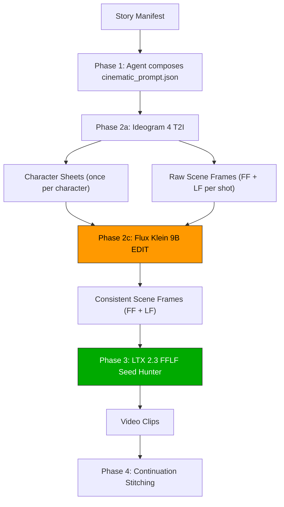

# Story-to-Video Cinematic Pipeline (V1) — Implementation Documentation

This document records the architectural details and code structure of the first version (V1) of the **`story-to-video-cinematic`** pipeline, implemented on **June 13, 2026**.

---

## 1. Pipeline Overview & Architecture

The cinematic pipeline replaces the legacy filmmaking skill's image generation stack (which used Flux 2 Dev Turbo) with a specialized **3-stage model chain** to achieve superior character consistency and prompt adherence:



### Stage-by-Stage Breakdown
1. **Ideogram 4.0 T2I (Generation)**: Responsible for generating multi-view character sheets (on neutral white backgrounds) and generating raw keyframes (First Frame/Last Frame) for scenes. It takes advantage of Ideogram's native structured JSON prompting and bounding box (bbox) coordinate system for precise spatial layout.
2. **Flux Klein 9B I2I (Editing)**: Positioned strictly as an **edit model**, not a generator. It takes the raw scene keyframe from Stage 1 as the background context (Image 1) and the character sheet as the identity reference (Image 2). It modifies only the character elements in the scene to lock in identity while preserving lighting, backgrounds, and environment.
3. **LTX 2.3 FFLF (Video Engine)**: Inherited directly from the proven filmmaking pipeline. It takes the consistent keyframes (First Frame + Last Frame) to interpolate motion and generate the final video segment.

---

## 2. Resource & VRAM Swapping Optimization

With a total model footprint of **~93GB** (Ideogram 4: ~29.6GB, Flux Klein: ~18.4GB, LTX 2.3: ~44.9GB), hosting and rendering all models concurrently on a single VRAM GPU is impossible. 

The [cinematic_orchestrator.py](file:///Users/muneesraja/projects/brainstorm/aurora/current-setup/skills/story-to-video-cinematic/scripts/cinematic_orchestrator.py) implements **Phase-level Batch Execution** to minimize ComfyUI model-swapping latency:

- **Batch Phase 1**: Generates all required character sheets via Ideogram 4.0.
- **Batch Phase 2**: Generates all raw FF and LF keyframes for the entire story via Ideogram 4.0.
- **Batch Phase 3**: Runs Flux Klein Edit passes across all raw frames, saving them to `scenes_edited/`.
- **Batch Phase 4 (LTX Sequential Loop)**: Runs FFLF video generation and tail frame extraction sequentially per chain (since continuation shots require the previous clip's tail frame as input).

---

## 3. Directory Layout

The implementation is modularized into a standalone skill path:

```
📂 current-setup/skills/story-to-video-cinematic/
├── 📄 SKILL.md                          # Skill triggers and triggers configuration
├── 📂 assets/
│   └── 📂 workflow-templates/
│       ├── 📄 ideogram-4-t2i.json       # Custom Ideogram 4 workflow template
│       └── 📄 flux-2-klein-image-edit.json # Custom Flux Klein Edit template
├── 📂 references/
│   ├── 📄 cinematic-prompt-schema.md    # Evolved prompt schema documentation
│   ├── 📄 flux-klein-edit-prompt-cookbook.md # Edit prompt composition guidelines
│   ├── 📄 ideogram-prompt-engineering.md # Bounding-box and JSON prompting guide
│   └── 📄 pipeline-architecture.md      # Flow diagrams and phase details
└── 📂 scripts/
    ├── 📄 cinematic_orchestrator.py      # The main pipeline orchestrator
    ├── 📄 flux_edit_pass.py              # Flux Klein interface wrapper
    ├── 📄 ideogram_generator.py          # Ideogram T2I interface wrapper
    └── 📄 verification_test.py           # Local template and compilation unit tester
```

Global provisioning tools are registered at:
- **Setup script**: [cinematic-pipeline-setup.sh](file:///Users/muneesraja/projects/brainstorm/aurora/workflows/setup/cinematic-pipeline-setup.sh)
- **Workflows copied to ComfyUI folder**:
- [ideogram-4-t2i.json](file:///Users/muneesraja/projects/brainstorm/aurora/workflows/comfyui/ideogram-4-t2i.json)
- [flux-2-klein-image-edit.json](file:///Users/muneesraja/projects/brainstorm/aurora/workflows/comfyui/flux-2-klein-image-edit.json)

---

## 4. Evolved Prompt Schema (`cinematic_prompt.json`)

V1 introduces schema **Version 2.0**, introducing explicit character descriptions, character-specific edit instructions, and primary-character targets:

```json
{
  "version": "2.0",
  "pipeline": "cinematic",
  "models": {
    "image_generator": "ideogram-4-t2i",
    "image_editor": "flux-2-klein-image-edit",
    "video_engine": "ltx-23-fflf-seed-hunter"
  },
  "global": {
    "style": "Cinematic 3D Pixar-style, soft volumetric lighting",
    "resolution_preset": "1080p",
    "fps": 25,
    "segment_duration": 5,
    "seed_base": 42
  },
  "characters": {
    "girl": {
      "description": "A 10-year-old girl with short brown hair, big green eyes, wearing a blue dress with white polka dots",
      "style_notes": "chibi proportions, 3D rendered, large head-to-body ratio",
      "edit_prompt_descriptor": "the young girl with brown hair and blue polka-dot dress"
    }
  },
  "shots": [
    {
      "scene": 1,
      "shot": 1,
      "shot_type": "chain_start",
      "first_frame_prompt": "establishing shot of a fantasy village at dawn, warm golden light, a girl stands at the edge of the frame looking outward",
      "last_frame_prompt": "same village, camera has pushed closer, the girl turned to face the camera with a confused expression",
      "motion_prompt": "camera slowly pans left showing the village",
      "filename_prefix": "film_001_shot001",
      "characters_present": ["girl"],
      "primary_character": "girl",
      "edit_pass": {
        "ff_edit_prompt": "Replace the young girl with brown hair in the scene with the character from reference 1, matching their exact appearance. Keep the background, lighting, and composition identical",
        "lf_edit_prompt": "Replace the young girl with brown hair in the scene with the character from reference 1, matching their exact appearance and confused expression. Keep the background and lighting identical"
      },
      "continues_from": null
    }
  ]
}
```

---

## 5. Summary of Automated Verification

We verified the local pipeline components:
1. **JSON Validation**: Evaluated that template JSON structures match ComfyUI schema.
2. **Workflow Builder Integration**: Confirmed that `workflow_builder.py` can compile the new `ideogram_t2i` and `flux_klein_edit` modes without leaving unreplaced placeholder keys.
3. **Dry-Run Checks**: Executed the orchestrator with `--dry-run` to confirm the recursive chain resolution and topology logic runs successfully.
