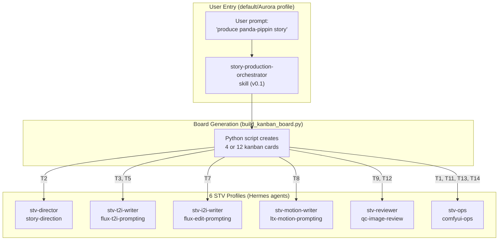
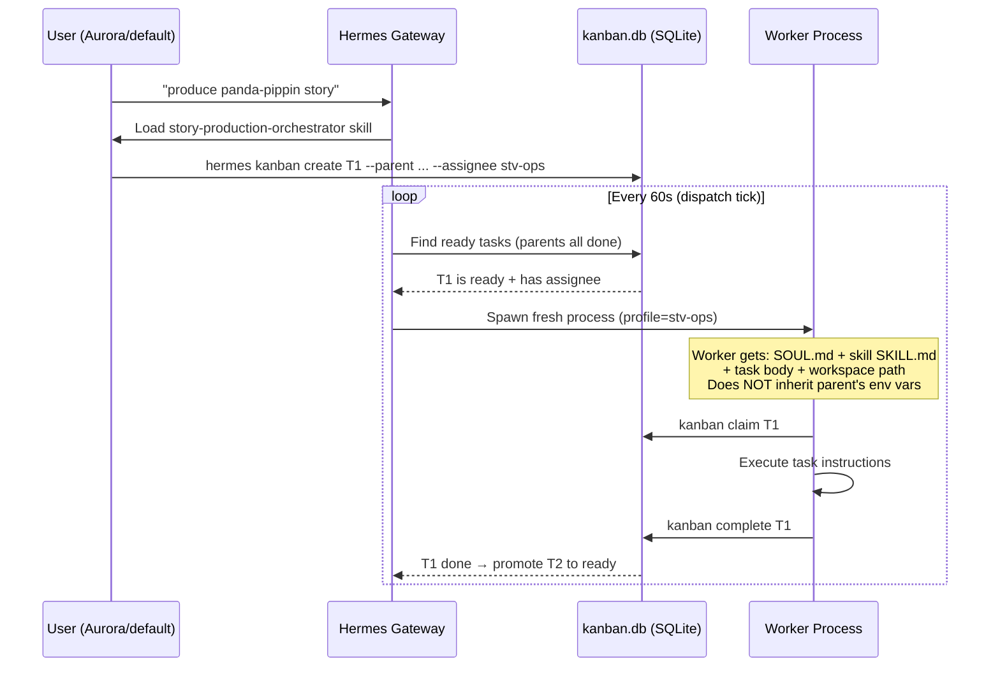
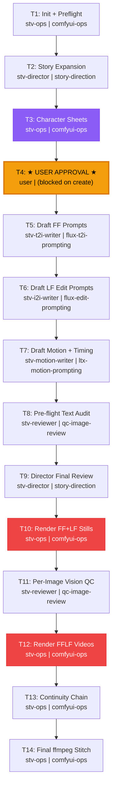

# Story Production Orchestrator — Re-Architecture Plan

> **Status**: Draft for review  
> **Date**: 2026-06-12  
> **Scope**: Re-architect `story-production-orchestrator` v0.1 → v1.0 based on learnings from panda-pippin  

---

## 1. Current State Assessment

### What Exists Today

````carousel

<!-- slide -->
### Panda-Pippin Board (Actual State)

| Task | Assignee | Status | Problem |
|---|---|---|---|
| T1: Init project | stv-ops | ✅ done | |
| T2: Story expansion | stv-director | ✅ done | |
| T3: Character sheets | stv-t2i-writer | ✅ done | **185 turns, 60/60 budget exhausted** |
| T4: Approval gate | user | ✅ done | |
| T5: FF prompts | stv-t2i-writer | ✅ done | |
| T6: Director review | stv-director | ✅ done | |
| T7: LF prompts | stv-i2i-writer | ✅ done | |
| T7-redo | stv-i2i-writer | ❌ blocked | **60/60 iterations exhausted** |
| T7-redo2 | stv-i2i-writer | ❌ blocked | **`flux-i2i-editing` skill hallucinated** |
| T8: Motion prompts | stv-motion-writer | ✅ done | |
| T8-redo | stv-motion-writer | ✅ done | Redo for verb-first format |
| T9: Pre-flight audit | stv-reviewer | ✅ done | |
| T10: Director final review | stv-director | ❌ blocked | Stuck — awaiting T7-redo resolution |
| T11-T14 | Various | ⏳ todo | Never reached |
````

### Five Root Causes (from panda-pippin + hermes-migration-analysis)

| # | Root Cause | Impact | Where |
|---|---|---|---|
| **RC1** | Skill name hallucination — director wrote `flux-i2i-editing` instead of `flux-edit-prompting` | Worker crash on spawn | [SOUL.md](file:///root/.hermes/profiles/stv-director/SOUL.md) has no profile→skill mapping |
| **RC2** | Worker env vars not inherited — `.env` missing from 4/6 profiles | Workers can't authenticate to ComfyUI | [v2 patch notes](file:///root/.hermes/skills/creative/story-production-orchestrator-v2-patch-notes/SKILL.md#L20-L28) |
| **RC3** | Wide-open task bodies — T3 said "build workflow, submit to ComfyUI" with no constraints | 185-turn rabbit hole building helpers from scratch | [STV_TASK_BODY_TEMPLATE.md](file:///root/repos/auto-startups-vast/current-setup/skills/story-to-video-filmmaking/references/STV_TASK_BODY_TEMPLATE.md) |
| **RC4** | Secret redaction mangling — `redact_secrets` matched `token` in variable names | Worker trapped in 80+ turn Python debug loop | [hermes-migration-analysis.md](file:///root/repos/auto-startups-vast/discussion-and-docs/hermes-migration-analysis.md#L51-L56) |
| **RC5** | `create` + `link` race condition — 60s dispatcher tick spawns unlinked children | 6 workers crashed on panda-pippin first attempt | [v2 patch notes](file:///root/.hermes/skills/creative/story-production-orchestrator-v2-patch-notes/SKILL.md#L14-L18) |

---

## 2. Hermes Kanban — How It Actually Works

> [!IMPORTANT]
> Understanding these mechanics is essential for the re-architecture. The orchestrator's job is to create the right cards with the right structure — Hermes handles the rest.

### Session & Worker Lifecycle



### Key Mechanics

| Mechanism | How it works | Pitfall |
|---|---|---|
| **Board isolation** | Each board has its own `kanban.db` + `workspaces/` + `logs/` | Use `--board` or `boards switch` before operations |
| **Parent-child deps** | Child stays in `todo` until ALL parents reach `done` | Use `--parent` on `create`, not post-hoc `link` (race condition) |
| **Dispatch** | Gateway ticks every 60s, spawns workers for `ready` tasks | Workers are **fresh processes** — no env var inheritance |
| **Worker env** | Worker reads its profile's `.env` + `config.yaml` + skill | Each profile needs its own `.env` with API keys |
| **Provider config** | `provider: minimax` is broken — must use `custom:minimax-anthropic` | Hardcoded path ignores `base_url` / `api_mode` |
| **Failure limit** | `kanban.failure_limit: 2` — auto-blocks after 2 consecutive failures | Override per-task with `--max-retries N` |
| **Human gates** | `kanban block` works on `ready`/`running` only | For `todo` tasks, use `--initial-status blocked` |
| **Secret redaction** | `security.redact_secrets: true` in config | Mangles Python files containing words like `token`, `auth` |

---

## 3. Proposed Re-Architecture (v1.0)

### 3.1 Design Principles

1. **The orchestrator is a router, not a worker** — it creates cards and monitors, never executes GPU/API work
2. **Tight task bodies** — every card follows the 4-section template (SETUP → HELPERS → SUCCESS CRITERIA → STOP CONDITION)
3. **Atomic `--parent` linking** — always use `--parent` on `create`, never post-hoc `link`
4. **Profile readiness as a pre-flight gate** — verify `.env`, skills symlinks, provider config before board creation
5. **Single human gate** — character sheet approval only; no second review gate
6. **File-based success gates** — `done_check.sh` is the only "are we done?" signal
7. **Explicit profile→skill mapping** — director SOUL.md must contain the canonical mapping table

### 3.2 New Task Graph (14 cards, v1.0-native)

> [!NOTE]
> The previous v1.0-native spec had 12 cards. Based on panda-pippin, we need 14: the director review after prompts (T10) is necessary, and the T7-redo pattern needs to be built into the graph rather than created dynamically.



### 3.3 Key Changes from v0.1/v0.2

| Change | Old (v0.1/v0.2) | New (v1.0) | Why |
|---|---|---|---|
| **T3 assignee** | `stv-t2i-writer` | `stv-ops` | Character sheets need ComfyUI execution, not prompt writing. Writer writes prompts; ops renders. In panda-pippin, T2I writer burned 185 turns trying to be ops |
| **Director SOUL** | No profile→skill map | Explicit mapping table injected | Prevents skill name hallucination (RC1) |
| **Task bodies** | Free-form descriptions | 4-section template mandatory | Prevents 185-turn rabbit holes (RC3) |
| **Board creation** | `create` then `link` | `create --parent` atomic | Prevents 60s race condition (RC5) |
| **Profile preflight** | Missing | Script verifies `.env`, symlinks, provider for all 6 profiles | Prevents RC2 |
| **Iteration budget** | 60 turns | 80 for text, 100 for GPU tasks | Panda-pippin showed 60 is too low for GPU tasks |
| **T3 split** | Director writes prompts + renders | T2 Director writes manifest → T3 Ops renders sheets from manifest | Clean responsibility boundary |
| **Continuity chain** | Part of T12 | Separate T13 | Tail frame extraction is complex; isolating it improves debuggability |

---

## 4. Detailed Card Specifications

### T1: Init + Preflight (`stv-ops`)

```markdown
## Task: T1 — Init project and verify infrastructure

### Setup
[Section 1: source .env, quickstart_auth.sh]

### Helpers
- curl_json() from comfyui_api.py for /system_stats
- No other helpers needed

### Success Criteria
1. /system_stats returns JSON with models: flux2-dev-turbo, ltx-23-22b, vae, gemma-3-12b
2. Work directory exists: <STORY>/
3. Story.md exists: <STORY>/Story.md
4. Characters dir created: <STORY>/characters/
5. Write roster.json: <STORY>/.roster.json with ComfyUI URL, loaded models, profile status

### Stop
When roster.json is written and all checks pass, complete. Do NOT run any rendering.
```

### T2: Story Expansion (`stv-director`)

```markdown
## Task: T2 — Expand Story.md to story_manifest.json v3

### Success Criteria
1. <STORY>/story_manifest.json exists with valid v3 schema
2. Shot count matches target duration (2 min ≈ 15-20 shots at 5-8s each)
3. Every shot has: shot_id, scene, shot_type, characters_present, facial_expression,
   duration_seconds, continues_from, qc_reference_strategy
4. character_sheets section lists each character with description + variant list

### Profile→Skill Map (ALWAYS use these exact names when creating tasks)
| Profile | Skill name (EXACT) |
|---|---|
| stv-director | story-direction |
| stv-t2i-writer | flux-t2i-prompting |
| stv-i2i-writer | flux-edit-prompting |
| stv-motion-writer | ltx-motion-prompting |
| stv-reviewer | qc-image-review |
| stv-ops | comfyui-ops |

### Stop
When story_manifest.json passes validation, complete. Do NOT write prompts or render anything.
```

### T3: Character Sheets (`stv-ops`)

> [!WARNING]
> This was the 185-turn catastrophe in panda-pippin. The new design assigns it to `stv-ops` (not `stv-t2i-writer`) and uses the tight body template with explicit helper imports.

```markdown
## Task: T3 — Render character reference sheets from manifest

### Setup
[Section 1: source .env, quickstart_auth.sh]

### Helpers
- Use generate_scene.py for single-shot Flux 2 Dev Turbo rendering
- Use curl_json(), wait_for_prompt(), download_output() from comfyui_api.py
- Do NOT write any new helper scripts. Do NOT modify existing ones.

### Input
- <STORY>/story_manifest.json → characters section for descriptions
- Model: flux2-dev-turbo-fp8mixed.safetensors (NOT flux1-dev)
- Style from manifest: e.g. "3D model" per user request

### Success Criteria
done_check.sh 100 must exit 0 for:
- <STORY>/characters/<char>_reference_sheet.png (one per character)

### Stop
When done_check.sh exits 0, post "T3 done: <paths>" and exit. No re-renders.

### Failure Budget
If you hit 80 turns without finishing, BLOCK with reason "T3 budget exhausted".
```

### T4: User Approval Gate

```markdown
## Task: T4 — APPROVAL GATE: Character sheet review
Created with --initial-status blocked

The orchestrator will present character sheet paths to the user.
User reviews → hermes kanban unblock <id> to proceed.
```

### T5-T7: Prompt Composition (Text-Only Tasks)

These are lightweight text tasks — the writer profiles read the manifest and produce JSON.

| Task | Assignee | Input | Output | Budget |
|---|---|---|---|---|
| T5 | stv-t2i-writer | story_manifest.json + character sheets | filmmaking_prompt.json → `first_frame_prompt` per shot | 40 turns |
| T6 | stv-i2i-writer | filmmaking_prompt.json + FF prompts | filmmaking_prompt.json → `last_frame_prompt` per shot (Edit-Instruction format) | 40 turns |
| T7 | stv-motion-writer | filmmaking_prompt.json + FF/LF prompts | filmmaking_prompt.json → `motion_prompt` + `overrides.segment_duration` | 40 turns |

### T8-T9: Review Gates

| Task | Assignee | What it checks | Pass criteria |
|---|---|---|---|
| T8 | stv-reviewer | Pre-flight text audit (FROZEN/SUBTLE/RADICAL) | All shots have non-frozen LF, token counts within budget |
| T9 | stv-director | Final directorial review of all prompts | Confirms shot rhythm, 180° line, no coverage gaps |

### T10-T14: GPU Rendering Pipeline

| Task | Assignee | What it does | Budget |
|---|---|---|---|
| T10 | stv-ops | Render FF+LF stills via Flux 2 Dev Turbo | 100 turns |
| T11 | stv-reviewer | Per-image vision QC (Gemini 3.1 Flash Lite) | 60 turns |
| T12 | stv-ops | Render FFLF videos via LTX 2.3 22B | 100 turns |
| T13 | stv-ops | Continuity chain: extract tail frames, re-render continuation shots | 80 turns |
| T14 | stv-ops | Final ffmpeg concat → `<story-slug>.mp4` | 20 turns |

---

## 5. Profile Readiness Preflight (NEW)

> [!CAUTION]
> In panda-pippin, 4 of 6 profiles were missing `.env` and skills symlinks. This must be a hard gate.

The orchestrator must run this check **before** creating any cards:

```python
REQUIRED_PROFILE_CONFIG = {
    "stv-director":       {"skills": ["story-direction"],          "env_keys": ["MINIMAX_API_KEY"]},
    "stv-t2i-writer":     {"skills": ["flux-t2i-prompting"],       "env_keys": ["MINIMAX_API_KEY"]},
    "stv-i2i-writer":     {"skills": ["flux-edit-prompting"],      "env_keys": ["MINIMAX_API_KEY"]},
    "stv-motion-writer":  {"skills": ["ltx-motion-prompting"],     "env_keys": ["MINIMAX_API_KEY"]},
    "stv-reviewer":       {"skills": ["qc-image-review"],          "env_keys": ["MINIMAX_API_KEY", "OPENROUTER_API_KEY"]},
    "stv-ops":            {"skills": ["comfyui-ops",
                                       "story-to-video-filmmaking"], "env_keys": ["MINIMAX_API_KEY", "COMFYUI_URL", "COMFYUI_USER", "COMFYUI_PASS"]},
}

for profile, reqs in REQUIRED_PROFILE_CONFIG.items():
    profile_dir = Path.home() / ".hermes" / "profiles" / profile
    # 1. Check .env exists and has required keys
    # 2. Check skills/ has symlinks for each required skill
    # 3. Check config.yaml has custom:minimax-anthropic provider
    # 4. If ANY check fails: ABORT with exact fix instructions
```

---

## 6. Director SOUL.md Patch

> [!IMPORTANT]
> The director dynamically creates tasks (e.g., T7-redo). It MUST have the canonical profile→skill mapping to avoid hallucinating skill names.

Add this section to [stv-director/SOUL.md](file:///root/.hermes/profiles/stv-director/SOUL.md):

```diff
+## Profile→Skill Mapping (MANDATORY for task creation)
+
+When creating or assigning tasks to any STV profile, you MUST use the
+exact skill name from this table. Do NOT guess or abbreviate.
+
+| Profile | Skill (EXACT) | Category |
+|---|---|---|
+| stv-director | story-direction | creative |
+| stv-t2i-writer | flux-t2i-prompting | creative |
+| stv-i2i-writer | flux-edit-prompting | creative |
+| stv-motion-writer | ltx-motion-prompting | creative |
+| stv-reviewer | qc-image-review | creative |
+| stv-ops | comfyui-ops | creative |
+
+**Wrong names that will CRASH the worker:**
+- ❌ `flux-i2i-editing` (use `flux-edit-prompting`)
+- ❌ `flux-prompting` (use `flux-t2i-prompting`)
+- ❌ `image-review` (use `qc-image-review`)
+- ❌ `comfyui` (use `comfyui-ops`)
```

---

## 7. `build_kanban_board.py` Rewrite Plan

The current [build_kanban_board.py](file:///root/repos/auto-startups-vast/current-setup/skills/story-production-orchestrator/scripts/build_kanban_board.py) needs these changes:

### 7.1 Use `--parent` Instead of Post-Hoc `link`

```diff
-# Current: create then link
-out = run(["hermes", "kanban", "create", "T2: ...", "--assignee", "stv-director", ...])
-tasks["T2"] = parse_task_id(out)
-run(["hermes", "kanban", "link", tasks["T1"], tasks["T2"]])
-
+# New: create with --parent
+out = run(["hermes", "kanban", "create", "T2: ...",
+    "--assignee", "stv-director",
+    "--parent", tasks["T1"],
+    "--skill", "story-direction",
+    "--workspace", f"dir:{story_path}",
+    "--max-runtime", "30m",
+    "--body", t2_body,
+])
+tasks["T2"] = parse_task_id(out)
```

### 7.2 Add Profile Preflight

```python
def verify_profiles() -> bool:
    """Hard gate: verify all 6 STV profiles are correctly configured."""
    all_ok = True
    for profile, reqs in REQUIRED_PROFILE_CONFIG.items():
        profile_dir = Path.home() / ".hermes" / "profiles" / profile
        # Check .env, skills symlinks, provider config
        # Print exact fix commands on failure
    return all_ok
```

### 7.3 Tight Task Body Generator

```python
def generate_task_body(task_id: str, task_desc: str, story_path: str, 
                       helpers: list, success_files: list, 
                       turn_budget: int = 80) -> str:
    """Generate a tight 4-section task body."""
    body = f"## Task: {task_id} — {task_desc}\n\n"
    body += SETUP_SECTION  # Always the same
    body += generate_helpers_section(helpers)
    body += generate_success_section(story_path, success_files)
    body += generate_stop_section(turn_budget)
    return body
```

### 7.4 T3 Reassignment: stv-t2i-writer → stv-ops

```diff
-("T3", "stv-t2i-writer", "flux-t2i-prompting", "Generate character sheets (T2I Flux 2)"),
+("T3", "stv-ops", "comfyui-ops", "Render character sheets from manifest"),
```

### 7.5 T4 Created as Blocked

```diff
+# T4 is created blocked — user must unblock after reviewing sheets
+out = run(["hermes", "kanban", "create", "T4: APPROVAL GATE",
+    "--assignee", "user",
+    "--parent", tasks["T3"],
+    "--initial-status", "blocked",
+    "--workspace", f"dir:{story_path}",
+    "--body", "Review character sheets. Run: hermes kanban unblock <id> to proceed.",
+])
```

---

## 8. Orchestrator SKILL.md Rewrite Scope

The [SKILL.md](file:///root/repos/auto-startups-vast/current-setup/skills/story-production-orchestrator/SKILL.md) needs these sections updated:

| Section | Change |
|---|---|
| Version | `0.1.0` → `1.0.0` |
| Quick-start | Remove v0.1-hybrid references; v1.0-native is now default |
| §1 Role | Add: verify profile readiness gate |
| §3 Pre-Flight | Add: profile readiness (`.env`, symlinks, provider) |
| §4 Board Generation | Replace v0.1-hybrid with v1.0-native 14-card graph; T3=stv-ops |
| §5 Human Gate | Add: T4 created with `--initial-status blocked` |
| §6 Failure Recovery | Add: `kanban edit` backfill, tight body template reference |
| §9 CLI Surface | Add: `--parent` on create, `--initial-status blocked` |
| §10 Cost | Update to realistic numbers from panda-pippin |
| NEW §12 | Profile→Skill canonical mapping table |
| NEW §13 | Tight body template reference |

---

## 9. What Gets the User's Prompt Working

When the user says:

> "We are going to use story-production-orchestrator skill. I've created a story called panda-pippin… Model: Flux 2 dev turbo, style: 3d model"

The orchestrator (Aurora/default profile) should:

1. **Load** `story-production-orchestrator` skill
2. **Run profile preflight** — verify all 6 STV profiles are configured
3. **Create board** `panda-pippin` (or switch to existing)
4. **Create 14 cards** with `--parent` linking, tight bodies, correct assignees
5. **Dispatch** — gateway picks up T1 on next 60s tick
6. **Monitor** via `notify_on_complete` — NOT active polling
7. **Surface T4** (character sheet gate) to user when T3 completes
8. **On T4 unblock** → downstream tasks auto-promote

The key parameters from the user's prompt get injected into task bodies:

| Parameter | Where it goes |
|---|---|
| Story name: `panda-pippin` | Board slug, all task bodies |
| Work folder: `/root/Syncthing/.../panda-pippin` | `--workspace dir:<path>` on every card |
| Model: `Flux 2 Dev Turbo` | T3, T10, T12 task bodies |
| Style: `3d model` | T2 (manifest) → propagates to all prompts |
| Duration: `2 mins` | T2 (manifest shot planning) → T7 (segment_duration) |
| ComfyUI URL | T1, T3, T10, T12 task bodies |
| Auth | From `.env` (NOT inline) |

---

## 10. Implementation Roadmap

> [!TIP]
> This plan can be executed as a single session. Use `/goal` for thorough execution.

| Phase | Task | Files to change | Est. effort |
|---|---|---|---|
| **P1** | Profile readiness script | New: `scripts/verify_profiles.py` | 30 min |
| **P2** | Director SOUL.md — add profile→skill map | Edit: `~/.hermes/profiles/stv-director/SOUL.md` | 10 min |
| **P3** | Rewrite `build_kanban_board.py` | Edit: `scripts/build_kanban_board.py` | 60 min |
| **P4** | Rewrite `SKILL.md` to v1.0 | Edit: `SKILL.md` | 45 min |
| **P5** | Fix all 6 profiles: `.env`, symlinks, provider config | Edit: 6× `profiles/stv-*/` | 30 min |
| **P6** | Dry-run test on panda-pippin (new board) | `build_kanban_board.py --mode v1.0-native <path>` | 15 min |
| **P7** | Live test: dispatch T1-T4 and verify character sheet gate | Monitor with `kanban watch` | 30 min |

---

## 11. Open Questions for User

> [!IMPORTANT]
> These decisions affect the implementation. Please review before I proceed.

1. **Should we keep v0.1-hybrid mode?** It wraps the monolith as a single card. Useful as a fallback, but adds code maintenance burden. Recommendation: **remove it** — the monolith path is still available directly via `filmmaking_orchestrator.py`.

2. **T3 assignee: stv-ops vs stv-t2i-writer?** The writer knows prompt vocabulary but can't render. In panda-pippin, the writer tried to be ops and burned 185 turns. Recommendation: **stv-ops renders, director provides prompt in manifest**.

3. **Should we archive the existing panda-pippin board** and start fresh, or continue from T10?

4. **Secret redaction** (`security.redact_secrets: true`): Should we disable it for STV profiles? It caused the 80-turn Python mangling loop. Recommendation: **disable for stv-ops and stv-reviewer profiles only** (they write scripts).

5. **Director's coach** (`--directors-coach`): The T6 and T9 director review cards are new. Should they be mandatory or opt-in? Recommendation: **mandatory for v1.0** — they caught 13 bad LF prompts in panda-pippin.
