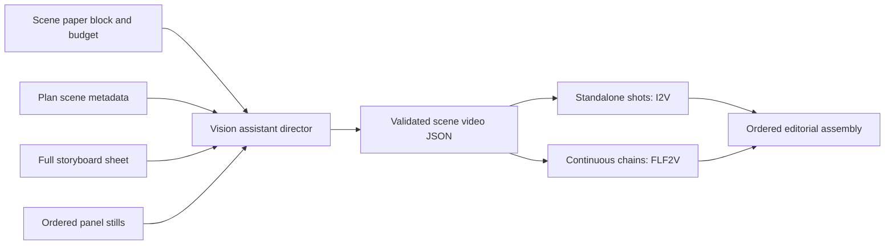

# FLF / Storyboard Assistant Director (reel_v2)

## Goal

Vision acts as an **assistant director** after storyboard sheets and panel stills exist. It reads the full sheet plus the scene agenda from `scene_paper.md` and produces a segment graph:

- Standalone / hard-cut panels → **I2V** (`start == end`)
- Physically continuous adjacent panels → **FLF2V** chains with shared endpoints (`02→03`, then `03→04`)
- Cast/subject/composition jumps → new segment (editorial cut); never FLF across the jump

**Duration:** the assistant director chooses per-clip and scene totals. Prefer LTX **6–10s** (`{6,8,10}`); **3s** only for super-short beats; never above **10s**. Scene-paper duration lines are editorial context only, not a hard budget.

**Grid / camera:** user text includes the 5×2 row/col map and same-row FLF candidates. Motivated camera pans/turns may bridge adjacent panels to a newly revealed subject (e.g. point → deer).

## Model

## Implementation status

1. ✅ Prompt: `prompts/reel_v2/flf_storyboard_planner.md` (segments + budget)
2. ✅ Planner/validator: `scripts/nodes/flf_storyboard_planner.py`
3. ✅ Production nodes: `scripts/nodes/storyboard_director_nodes.py`
4. ✅ Gated main graph branch (`STORYBOARD_VIDEO_MODE=director`) after `panel_regen`
5. ✅ CLI: `scripts/run_flf_scene.py` (shared planner/generator)
6. ✅ Schema: `StoryboardVideoScenePlan` / `DirectorSegment` / `DirectorClip`
7. ✅ Scene-paper duration budgets overwrite plan scene budgets in storyboard normalize
8. ✅ Unit tests: `tests/test_flf_storyboard_planner.py`

## Config

- `STORYBOARD_VIDEO_MODE=fallback` (default) — existing `video_shots` I2V path
- `STORYBOARD_VIDEO_MODE=director` — assistant-director I2V/FLF path
- `FLF_DURATION_TOLERANCE_PERCENT=15`
- Templates remain `ltx-i2v` and `ltx-flf2v` (not the official FLF UI export)

## Persistence

- Primary: `generation_specs.storyboard_video_scenes[scene_id]`
- Legacy mirror: `generation_specs.flf2v_scenes[scene_id]`
