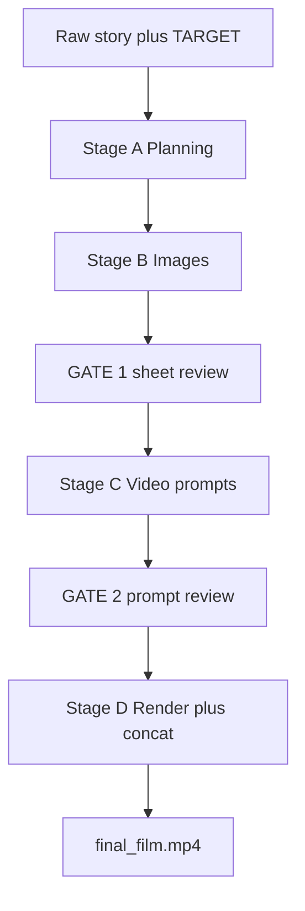
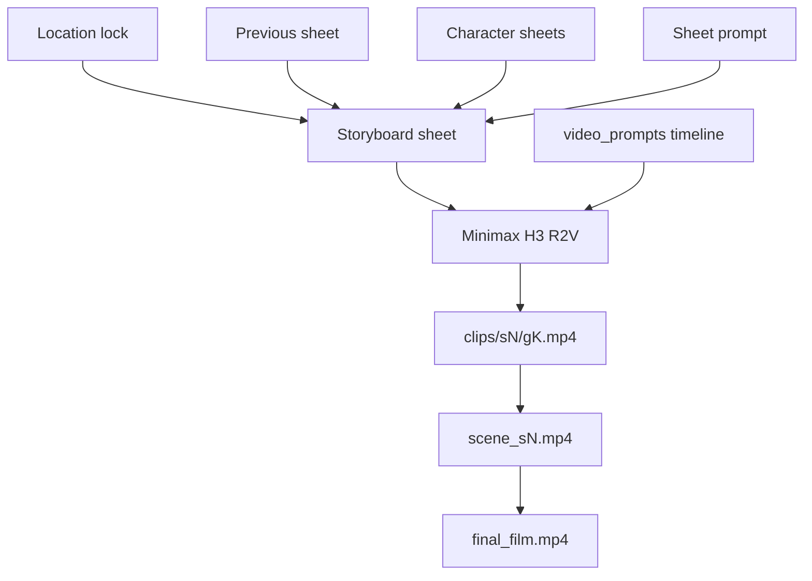

# Story Maker V4c — project context

Turns a high-level story (or commercial brief) plus a target duration into `final_film.mp4`. **Claude Code is the brain** (authors every markdown/text artifact, runs validators, reads storyboard sheets for the vision step). **Python is the hands** (image gen, Minimax H3 render, concat). Python makes **zero LLM calls**. There is no ADK and no LiteLLM. Video backend is **Minimax H3 R2V via ComfyUI**: each generation is at most **15 seconds** and renders from one storyboard sheet plus a Hailuo 3.0 timeline prompt, with native stereo audio.

Operational runbook: [`SKILL.md`](SKILL.md). Authoring specs: [`prompts/creature_behavior.md`](prompts/creature_behavior.md), [`prompts/coverage.md`](prompts/coverage.md), [`prompts/commercial_ad.md`](prompts/commercial_ad.md) (ads only), [`assets/minimax-h3-prompt-bible.md`](assets/minimax-h3-prompt-bible.md).

## Brain / hands split

| Layer | Owner | What it does |
|-------|-------|--------------|
| Authoring (Agents 1–5) + validation loop + vision | Claude Code | Writes `developed_story.md`, `scenes.md`, `storyboard_*.md`, image prompts, `video_prompts/*.txt`; Reads sheet images; runs `scripts/validate.py` and fixes until `ok:true` |
| Image media | Python via Bash | `scripts/build_images.py` → Replicate / fal (character sheets, location locks, storyboard sheets) |
| Video render + concat | Python background batch | `scripts/render_all.py` → one ComfyUI Minimax H3 render per generation, then concat |

## Chunking model

- **1 scene = N generations**
- **1 generation = 1 storyboard sheet = 1 Minimax H3 render**, **5–15s**
- A shot never straddles a generation boundary. A shot that cannot finish inside the current generation moves — panels and all — to the next sheet.
- A ~70s scene ≈ 5 generations. Scene count is `ceil(TARGET / 70)`.

Output layout:

- Episode run: `outputs/story-maker-v4c/<story>/epi-N/`
- Shared assets (never wiped): `outputs/story-maker-v4c/<story>/assets/` (`characters/{cid}.png`, `locations/{lid}.png`)

Resume: before each step, continue from the first missing artifact. Build/render scripts skip existing files.

## Pipeline stages

## Authoring waterfall

Durable artifacts in order:

1. `developed_story.md` (Agent 1) — no validator
2. `scenes.md` (Agent 2) → `--schema scenes`
3. `storyboard_<scene>.md` (Agent 3) → `--schema storyboard`
4. `image_prompts/characters/`, `locations/`, `<scene>/storyboard_sheet_<gen>.txt` (Agent 4) → `--schema prompts`
5. `assets/characters/*.png`, `assets/locations/*.png` (Python, once)
6. `storyboard_sheet_<scene>_<gen>.png` / `.webp` (Python, per generation) — **GATE 1**
7. `video_prompts/<scene>_<gen>.txt` (Agent 5, vision) → `--schema video_prompt` — **GATE 2**
8. `clips/<scene>/<gen>.mp4` (Minimax H3)
9. `scene_<scene>.mp4` then `final_film.mp4` (concat, audio preserved)

Each validator writes `<artifact>.validation.json` and exits nonzero on failure. Failed validation blocks the paid downstream step.

## Continuity and media

Sheet chain: location + previous sheet + character refs → next sheet. `g1 → g2 → …` inside a scene; the last sheet of the previous scene feeds the first generation of the next. Continuity is authored (sheet refs + “Continue directly from the previous scene” prompt lines), not automatic. Each generation is an independent render. The sheet is the **only** Minimax reference image; no panel crops or upscales.

## Stage map

- **A1–A4 (planning, no image spend):** write → validate → fix. Agent 1 sets Tone, emotion, `creature_role:`. Agent 2 `beat` includes stakes/emotion/animal state. Agent 3 follows `coverage.md` (micro-shots only for `play_comedy`). Agent 4 paints subject/situation, not a new camera every panel.
- **B1–B2 (images):** `scripts/build_images.py --assets-only` then `--scene sN`. Replicate (default) or fal. Sheets are 3840×2160, text-free panel grids.
- **GATE 1:** stop for visual confirmation of all sheets. Runbook rule, not code-enforced.
- **C1 (vision):** I2V H3 prompt from the **drawn** sheet: takeaway, three sound fields, one camera sentence, `(S1)` + `<d>`. Never `char_NN`. Generation-local times. Ads: one job per gen.
- **GATE 2:** stop for video-prompt review before paid GPU hours. One-variable regen if needed.
- **D1 (render):** `scripts/render_all.py` — ComfyUI Minimax H3, resume-safe skip of existing clips, concat scenes into `final_film.mp4`. Hours; fire-and-forget.

## Repo map

| Role | Path |
|------|------|
| Runbook | [`SKILL.md`](SKILL.md) |
| Image + ComfyUI config | [`config.py`](config.py) |
| Validate | [`scripts/validate.py`](scripts/validate.py) |
| Still images | [`scripts/build_images.py`](scripts/build_images.py) |
| Render + concat | [`scripts/render_all.py`](scripts/render_all.py) |
| Schemas / parsers | [`tools/validators.py`](tools/validators.py) |
| Image dispatch | [`tools/image_pipeline.py`](tools/image_pipeline.py) |
| Character / location plates | [`tools/char_sheet_builder.py`](tools/char_sheet_builder.py), [`tools/location_sheet_builder.py`](tools/location_sheet_builder.py) |
| Minimax workflow | [`tools/minimax_workflow.py`](tools/minimax_workflow.py) |
| ComfyUI client | [`tools/comfyui_tools.py`](tools/comfyui_tools.py) |
| Concat | [`tools/video_concat.py`](tools/video_concat.py) |
| Authoring prompts | [`prompts/`](prompts/) |
| Creature / coverage / ads | [`prompts/creature_behavior.md`](prompts/creature_behavior.md), [`prompts/coverage.md`](prompts/coverage.md), [`prompts/commercial_ad.md`](prompts/commercial_ad.md) |
| Minimax H3 prompt bible | [`assets/minimax-h3-prompt-bible.md`](assets/minimax-h3-prompt-bible.md) |

Workflow JSON (referenced, not copied): repo-root `workflows/comfyui/Minimax H3 R2V - Final.json` (override with `MINIMAX_H3_WORKFLOW`).

## Non-goals and pitfalls

- No ADK, no LiteLLM, no Python LLM calls.
- **15 seconds, period.** No generation over 15s; no shot across a generation boundary.
- Storyboard sheets must be text-free (timecodes leak into video).
- Video prompts must use appearance language; `char_NN` is rejected by the validator.
- Always load episode context (and previous-episode handoff for episode 2+) before authoring.
- Never print `COMFYUI_AUTH`, `FAL_KEY`, or `REPLICATE_API_TOKEN`.
- The sheet wins over the plan: Agent 5 describes what was drawn.
- Gates are mandatory: stop and ask the user at GATE 1 and GATE 2.
- **Authoring pitfall:** missing visible emotion, missing per-creature role/state, situation-less cameras, first-frame-only H3 prompts, mixed sound layers, no viewer takeaway, or a stuffed campaign in one 15s generation. MiniMax H3 only.
